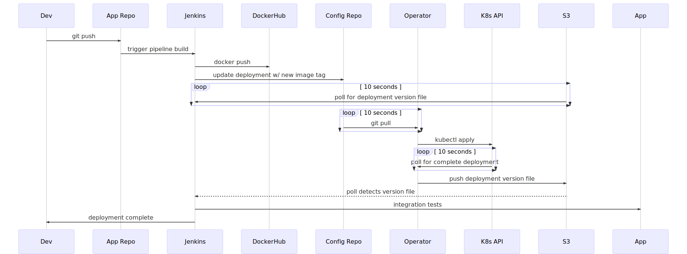

# git-sync-operator

The git-sync-operator syncs from git to Kubernetes. It's magical.

## Project Status

This project is currently a work in progress.

## Rationale

- Remove the need for our CI/CD pipeline to communicate directly with Kubernetes.

  - This helps us improve security.

- Remove our dependency on Deis Workflow.

- Help support multi-cloud deployments.


## High level overview

The git-sync-operator polls a git repo for changes that will be applied to a single K8s namespace. These changes will most likely be the result of a CI/CD pipeline commiting a new Docker image hash to git. Applications running in multiple namespaces (dev, stage, prod etc) require a git-sync-operator running in each. If changes are detected in git, apply yaml to the current K8s namespace. Once all pods are up and running, push a file to S3 to signal to CI/CD that it can proceed. If the change fails to apply to K8s, CI/CD job will time out and fail.

## Project Organization

A git-sync-operator managed application is contained in 2 git repos:

- the main application repo, containing the app code

- an app config repo, containing Kubernetes deployments, services and any other relevant configuration data.

For example, bedrock (www.mozilla.org) is split into:

- the main application repo: https://github.com/mozilla/bedrock

- a configuration repo: https://github.com/mozmeao/www-config

### Naming conventions

- `./all-clusters/$namespace`

  - while the git-sync-operator does not use this directory explicitly, CI/CD can be used to make deployments to multiple regions serially by copying and committing yaml from `./all-clusters/your_namespace` to `$cluster_name/$namespace` a region-at-a-time.

- `./$cluster_name/$namespace`

  - this yaml is applied to the given cluster and namespace if the git-sync-operator is currently running in that cluster and namespace.

- K8s deployments should be contained in a file named `deploy.yaml`

- K8s services should be contained in a file named `svc.yaml`

- K8s horizontal pod autoscalers should be contained in a file named `hpa.yaml`

### Directory Layout

Below is an example layout (taken from [www-config](https://github.com/mozmeao/www-config)):

```
.
├── Dockerfile
├── Jenkinsfile
├── LICENSE
├── README.md
├── bin
├── configs
├── docs
├── jenkins
├── all-clusters
│   ├── bedrock-dev
│   │   ├── deploy.yaml
│   │   ├── hpa.yaml
│   │   └── svc.yaml
│   ├── bedrock-prod
│   │   ├── deploy.yaml
│   │   ├── hpa.yaml
│   │   └── svc.yaml
├── git-sync-operator
│   └── rbac.yaml
├── iowa-a
│   ├── bedrock-demo
│   │   └── git-sync-operator.yaml
│   ├── bedrock-dev
│   │   ├── configmap.yaml
│   │   ├── deploy.yaml
│   │   ├── git-sync-operator.yaml
│   │   ├── hpa.yaml
│   │   └── svc.yaml
│   ├── bedrock-prod
│   │   ├── configmap.yaml
│   │   ├── deploy.yaml
│   │   ├── git-sync-operator.yaml
│   │   ├── hpa.yaml
│   │   └── svc.yaml
```


### Version K8s Custom Resource Definition (CRD)

The git-sync-operator uses a K8s CRD to manage installed versions of an application.

The `Version` CRD contains up to two values:

- `applied`: the git-sha of the config repo commit that has been applied to the cluster with `kubectl apply`. This value represents a deployment in progress.
- `deployed`: Once all pods in the namespace are up and in ready state, this value will contain the git-sha of the config repo commit that has been successfully deployed.

#### Example

```
apiVersion: versions.mozilla.org/v1
kind: Version
metadata:
  name: example-dev
applied: abcdef0
deployed: abcdef0
```


## Sequence

</img>


1. A developer pushes a branch to a git repo.

2. Jenkins triggers a pipeline build of the branch.

3. A Docker image is built and pushed to Dockerhub.

4. The configuration repo for the application is updated with a new image hash.

5. Jenkins polls an S3 bucket until it detects a version file

   1. This file is created by the git-sync-operator upon completion of a deployment

6. The git-sync-operator polls the config repo for any changes, comparing application image hashes with that in the deployment in the current namespace.

7. If changes are detected, the git-sync-operator applies all new configuration yaml that has changed in the app configuration repo.

8. If changes have been applied by the git-sync-operator, wait until all pods in the deployment are running AND ready.

9. If all pods in the deployment are running and ready, push a version file to a specified S3 bucket

   1. Jenkins has been waiting for this file to be created as part of step 5.

10. If Jenkins detects a new version file, continue pipeline build. Otherwise, the build times out.

11. Run integration tests against the updated deployment.

12. If integration tests pass, the build is complete. Otherwise, the build fails.

### Parallel vs Serial deployments

If the git-sync-operator is running in multiple clusters for the same application/namespace, then all clusters may update at the same time during a deployment. This may be undesirable, and it is recommended that the CI job only commits changes to specific cluster namespace subdirectories one at a time.

For example, we use an `all-clusters` directory containing namespace subdirectories that Jenkins will copy over to a specific cluster namespace subdirectory. That's a mouthful, so here's a more concrete example:

For each $cluster in [foo, bar, baz]:

1. Jenkins copies and commits `./all-clusters/bedrock-dev/*` to `./$cluster/bedrock-dev/`.
2. The git-sync-operator in the $cluster detects the commit and applies changes. When it's done, it signals back to Jenkins via a file in S3 that it's finished.
3. Jenkins moves on to the next cluster in the list.


## S3 version notification <a name="s3notification"></a>

When the git-sync-operator finishes deploying to a namespace, a version file is written to a directory using the following path scheme:

`cluster_name/namespace/deployment_name/version_hash`

The file currently contains the current date and time in UTC format.

## Per-namespace Installation

TODO
### RBAC

Each namespace will need a chunk of RBAC yaml appended to `git-sync-operator/rbac.yaml`.  The snippet below shows the yaml required to configure `bedrock-prod` to use the git-sync-operator.

```yaml
---
apiVersion: v1
kind: ServiceAccount
metadata:
  name: bedrock-prod-git-sync-operator
  namespace: bedrock-prod
---
apiVersion: rbac.authorization.k8s.io/v1
kind: RoleBinding
metadata:
  name: grant-git-sync-operator-access
  namespace: bedrock-prod
subjects:
- kind: ServiceAccount
  name: bedrock-prod-git-sync-operator
  namespace: bedrock-prod
roleRef:
  kind: ClusterRole
  name: git-sync-operator
  apiGroup: rbac.authorization.k8s.io
```

Only one ClusterRole needs to be defined per cluster. We keep namespace configs (shown directly above) after the ClusterRole like this:

```yaml
# https://kubernetes.io/docs/admin/authorization/rbac/#rolebinding-and-clusterrolebinding
apiVersion: rbac.authorization.k8s.io/v1
kind: ClusterRole
metadata:
  name: git-sync-operator
rules:
- apiGroups:
  - ""
  resources:
  - configmaps
  - persistentvolumeclaims
  - services
  - services/proxy
  verbs:
  - create
  - get
  - list
  - patch
  - update
  - watch
- apiGroups:
  - apps
  resources:
  - deployments
  - deployments/rollback
  - deployments/scale
  verbs:
  - create
  - get
  - list
  - patch
  - update
  - watch
- apiGroups:
  - autoscaling
  resources:
  - horizontalpodautoscalers
  verbs:
  - create
  - get
  - list
  - patch
  - update
  - watch
- apiGroups:
  - batch
  resources:
  - cronjobs
  - jobs
  verbs:
  - create
  - get
  - list
  - patch
  - update
  - watch
- apiGroups:
  - extensions
  resources:
  - deployments
  - deployments/rollback
  - deployments/scale
  - ingresses
  - replicasets
  - replicasets/scale
  - replicationcontrollers/scale
  verbs:
  - create
  - get
  - list
  - patch
  - update
  - watch
- apiGroups:
  - apiextensions.k8s.io
  resources:
  - customresourcedefinitions
  verbs:
  - create
  - get
  - list
  - patch
  - update
  - watch
- apiGroups:
  - mozilla.org
  resources:
  - versions
  verbs:
  - create
  - get
  - list
  - patch
  - update
  - watch
---
apiVersion: v1
kind: ServiceAccount
metadata:
  name: bedrock-prod-git-sync-operator
  namespace: bedrock-prod
---
apiVersion: rbac.authorization.k8s.io/v1
kind: RoleBinding
metadata:
  name: grant-git-sync-operator-access
  namespace: bedrock-prod
subjects:
- kind: ServiceAccount
  name: bedrock-prod-git-sync-operator
  namespace: bedrock-prod
roleRef:
  kind: ClusterRole
  name: git-sync-operator
  apiGroup: rbac.authorization.k8s.io
```

### S3-push IAM user <a name="S3IAM"></a>

Configure a user with S3 push-only access with the following policy:

```yaml
{
    "Version": "2012-10-17",
    "Statement": [
        {
            "Sid": "VisualEditor0",
            "Effect": "Allow",
            "Action": [
                "s3:PutObject",
                "s3:PutObjectAcl"
            ],
            "Resource": "arn:aws:s3:::your-deployment-bucket/*"
        }
    ]
}
```

### Deployment Configuration

Environment variables:

- `CONFIG_REPO`
    - the application configuration git repo to watch for changes. 
- `MANAGED_NAMESPACES`
    - the K8s namespace that git-sync-operator is managing.
- `CLUSTER_NAME`
    - the name of the current K8s cluster.
- `S3_BUCKET`
    - write a version file to this bucket when a deployment is complete.
    - see the section titled [S3 version notification](#s3notification) for more info.
- `AWS_ACCESS_KEY_ID`
    - The AWS creds used to write to S3
    - See [S3-push IAM user](#S3IAM) for more info
    - **This MUST be stored as a K8s secret.**
- `AWS_SECRET_ACCESS_KEY`
    - The AWS creds used to write to S3
    - See [S3-push IAM user](#S3IAM) for more info
    - **This MUST be stored as a K8s secret.**

## License

[Mozilla Public License v2](https://www.mozilla.org/en-US/MPL/2.0/)
